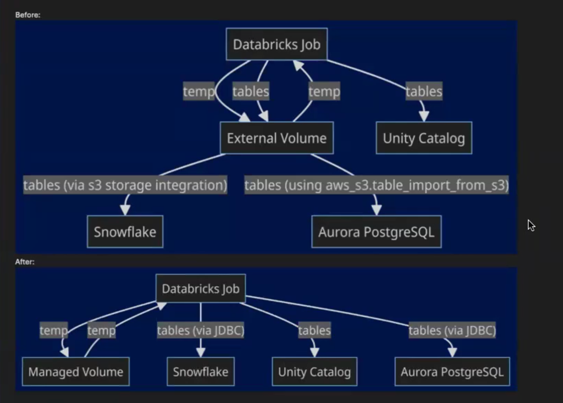
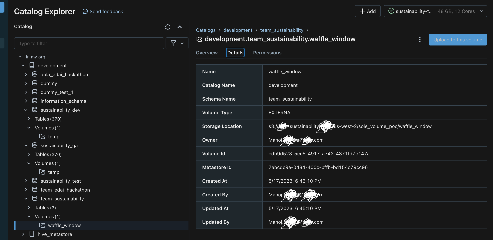
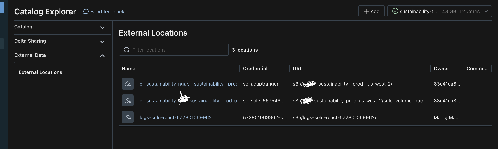
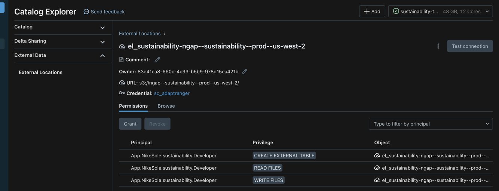
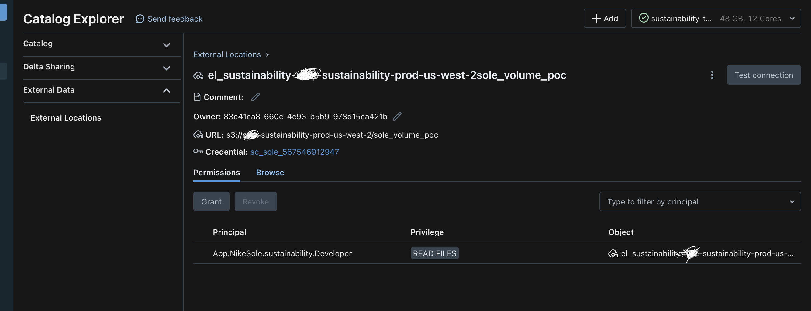
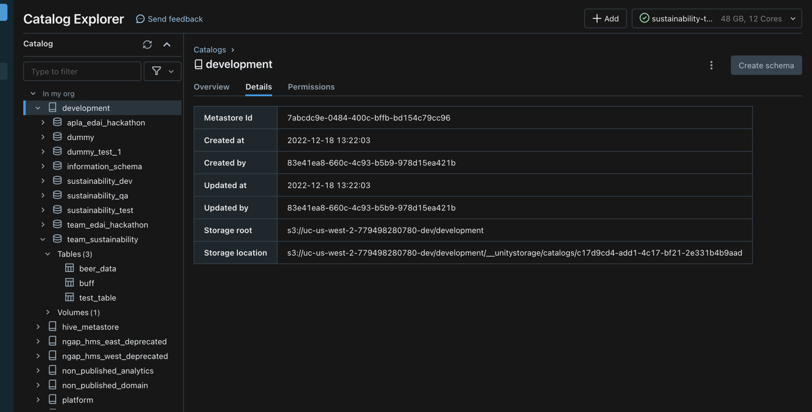
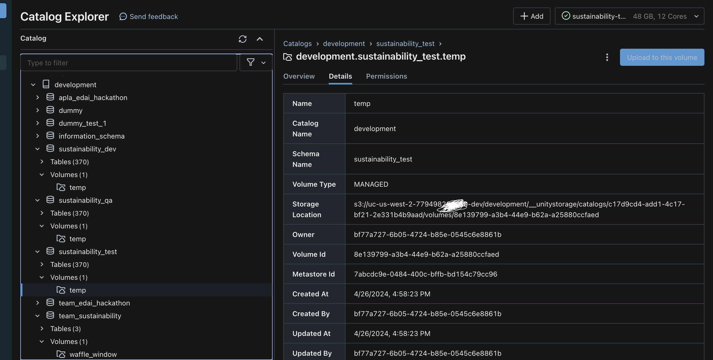

****# Change Log

### Request for External Volume Rejected - Work Around

**Feature Title**:

External Volume for sustainability DataAdmin

**Feature Description**:


* Developer Service Principal had permissions to read and write `sustainability_dev`, `sustainability_qa` schemas, in `development` catalog, but not to `sustainability_prod`.
* Admin Service Principle had permissions to read and write `sustainability_prod` schema in `non_published_domain` catalog, but didn't have read-write access to external UC Volume


* UC Managed Volume - for Temp storage - for executors to Write to a temp location, and later collect them from driver. - no need for UC External Volume - default storage for databricks workspace, but can't be used outside databricks.
* External Volume - Platform team direction - No More External Volume - can't use S3 for Egress from Databricks
* External Location - to read in from External S3 bucket, only accessible from driver - but writing out to waffle-iron bucket - not allowed


Currently, our data admin service principal, `Sole.ServicePrincipal.sustainability.DataAdmin`, cannot access our external volume (`el_sustainability_sustainability-prod-us-west-2_sole_volume_poc`). We need this remedied ASAP.


```
2024-03-31 23:01:41,136 - file_system_client.base - INFO - Putting a success indicator: temp/blender/full/supplied-material/fragmented/date_partition=2024-03-31-23-01/

PermissionError: [Errno 13] Permission denied: '/Volumes/development/team_sustainability/waffle_window/prod/temp/blender/full/supplied-material/fragmented/date_partition=2024-03-31-23-01/_SUCCESS'
```
```
Py4JJavaError: An error occurred while calling z:org.apache.spark.api.python.PythonRDD.collectAndServe.
: org.apache.spark.SparkException: Job aborted due to stage failure: Task 2 in stage 0.0 failed 4 times, most recent failure: Lost task 2.3 in stage 0.0 (TID 11) (100.64.68.124 executor 0): org.apache.spark.api.python.PythonException: Traceback (most recent call last):
  File "/databricks/spark/python/pyspark/worker.py", line 1841, in main
    process()
  File "/databricks/spark/python/pyspark/worker.py", line 1833, in process
    serializer.dump_stream(out_iter, outfile)
  File "/databricks/spark/python/pyspark/serializers.py", line 357, in dump_stream
    vs = list(itertools.islice(iterator, batch))
  File "/databricks/spark/python/pyspark/util.py", line 88, in wrapper
    return f(*args, **kwargs)
  File "/local_disk0/.ephemeral_nfs/cluster_libraries/python/lib/python3.10/site-packages/nike/analytics_etl/broker.py", line 397, in wrapper
    return function(*args)
  File "/local_disk0/.ephemeral_nfs/cluster_libraries/python/lib/python3.10/site-packages/nike/enablon_etl/broker.py", line 329, in extract_transform_table
    raise error
  File "/local_disk0/.ephemeral_nfs/cluster_libraries/python/lib/python3.10/site-packages/nike/enablon_etl/broker.py", line 314, in extract_transform_table
    self.write_parquet(
  File "/local_disk0/.ephemeral_nfs/cluster_libraries/python/lib/python3.10/site-packages/nike/analytics_etl/utilities.py", line 56, in wrapper
    return function(*args, **kwargs)
  File "/local_disk0/.ephemeral_nfs/cluster_libraries/python/lib/python3.10/site-packages/nike/analytics_etl/broker.py", line 939, in write_parquet
    self.file_system.put(data_frame_io, path)
  File "/local_disk0/.ephemeral_nfs/cluster_libraries/python/lib/python3.10/site-packages/nike/file_system_client/dbfs.py", line 89, in put
    with open(path, "wb") as file_io:
PermissionError: [Errno 13] Permission denied
Error encountered while attempting to write data for the table CSR_OBJECTIVE_CUST ... (truncated)
```

Our DataAdmin role needs to be able to write (not just read) to `s3://sustainability-prod-us-west-2/sole_volume_poc` in order to support pre-existing integrations. Currently, only our Developer role is able to do so (`Sole.ServicePrincipal.sustainability.Developer`).
This need has become urgent due to a Databricks runtime issue described in this slack thread: https://nikedigital.slack.com/archives/C05Q8MAG6SZ/p1711728034059309

**Use Case Enabled**: We use this volume for temporary/session storage and staging data for loading into Snowflake.



3 schemas, 3 managed volumes within them for 3 environments(dev, qa, test) and another schema (team_sustainability) for external volume ..




Below are external locations configure to read from external S3 buckets



Access rules are not determined by which schema a volume resides under, rather by which ServicePrincipal is assigned read-write permissions.





Below S3 path represents the ROOT Location where everything related to this catalog resides.



Below S3 Path represents the Path under the Catalog Path, where managed volume resides.



`Create Maneged Volumes` --> `Update analytics-etl to Leverage Spark Snowflake Connector for Loading`


### Update analytics-etl to Leverage Spark Snowflake JDBC Connector for Loading into Snowflake
* Update `analytics_etl.broker.Work.snowflake_load_table` to use Spark to write to Snowflake rather than executing a `COPY INTO` command when run on Databricks (non-Spark jobs will need to retain the same behavior).
* Update `analytics_etl.broker.Broker._spark_merge` to not write to the tables directory when run on Databricks (local testing and non-Spark jobs will still need to, however).
* Increment the major version with this change, to avoid premature/accidental upgrades


### Other Errors

```
run failed with error message
 Library installation failed for library due to user error for pypi {
  package: "alembic===1.13.1"
  repo: "https://artifactory.nike.com/artifactory/api/pypi/python-virtual/simple"
}
 Error messages:
Library installation attempted on the driver node of cluster 0330-210933-65ohtk0c and failed. Please refer to the following error message to fix the library or contact Databricks support. Error Code: DRIVER_LIBRARY_INSTALLATION_FAILURE. Error Message: org.apache.spark.SparkException: Process List(/bin/su, libraries, -c, bash /local_disk0/.ephemeral_nfs/cluster_libraries/python/python_start_clusterwide.sh /local_disk0/.ephemeral_nfs/cluster_libraries/python/bin/pip install 'alembic==\=1.13.1' --index-url https://artifactory.nike.com/artifactory/api/pypi/python-virtual/simple --disable-pip-version-check) exited with code 1. ERROR: Could not find a version that satisfies the requirement alembic ...
***WARNING: message truncated. Skipped 955 bytes of output**

```

```
Py4JJavaError: An error occurred while calling o1162.parquet.
: com.databricks.sql.managedcatalog.acl.UnauthorizedAccessException: PERMISSION_DENIED: User does not have USE SCHEMA on Schema 'development.team_sustainability'.
	at com.databricks.managedcatalog.UCReliableHttpClient.reliablyAndTranslateExceptions(UCReliableHttpClient.scala:87)
	at com.databricks.managedcatalog.UCReliableHttpClient.get(UCReliableHttpClient.scala:139)
	at com.databricks.managedcatalog.ManagedCatalogClientImpl.$anonfun$getVolume$2(ManagedCatalogClientImpl.scala:5080)
	at com.databricks.managedcatalog.ManagedCatalogClientImpl.handleVolumeException(ManagedCatalogClientImpl.scala:5283)
	at com.databricks.managedcatalog.ManagedCatalogClientImpl.$anonfun$getVolume$1(ManagedCatalogClientImpl.scala:5080)
	at com.databricks.managedcatalog.ManagedCatalogClientImpl.$anonfun$recordAndWrapException$2(ManagedCatalogClientImpl.scala:4574)
	at com.databricks.spark.util.FrameProfiler$.record(FrameProfiler.scala:94)
	at com.databricks.managedcatalog.ManagedCatalogClientImpl.$anonfun$recordAndWrapException$1(ManagedCatalogClientImpl.scala:4573)
	at com.databricks.managedcatalog.ErrorDetailsHandler.wrapServiceException(ErrorDetailsHandler.scala:25)
	at com.databricks.managedcatalog.ErrorDetailsHandler.wrapServiceException$(ErrorDetailsHandler.scala:23)
	at com.databricks.managedcatalog.ManagedCatalogClientImpl.wrapServiceException(ManagedCatalogClientImpl.scala:148)
	at com.databricks.managedcatalog.ManagedCatalogClientImpl.recordAndWrapException(ManagedCatalogClientImpl.scala:4570)
	at com.databricks.managedcatalog.ManagedCatalogClientImpl.getVolume(ManagedCatalogClientImpl.scala:5075)
	at com.databricks.sql.managedcatalog.ManagedCatalogCommon.getVolume(ManagedCatalogCommon.scala:1793)
	at com.databricks.sql.managedcatalog.ProfiledManagedCatalog.$anonfun$getVolume$1(ProfiledManagedCatalog.scala:854)
	at org.apache.spark.sql.catalyst.MetricKeyUtils$.measure(MetricKey.scala:660)
	at com.databricks.sql.managedcatalog.Profile ... (truncated)
```

```
Py4JError: An error occurred while calling o1197.getQueryContext. Trace:
py4j.Py4JException: Method getQueryContext([]) does not exist
	at py4j.reflection.ReflectionEngine.getMethod(ReflectionEngine.java:344)
	at py4j.reflection.ReflectionEngine.getMethod(ReflectionEngine.java:352)
	at py4j.Gateway.invoke(Gateway.java:297)
	at py4j.commands.AbstractCommand.invokeMethod(AbstractCommand.java:132)
	at py4j.commands.CallCommand.execute(CallCommand.java:79)
	at py4j.ClientServerConnection.waitForCommands(ClientServerConnection.java:195)
	at py4j.ClientServerConnection.run(ClientServerConnection.java:115)
	at java.lang.Thread.run(Thread.java:750)
```

```
TypeError: AutoFormattedTB.structured_traceback() missing 1 required positional argument: 'evalue'

UnsupportedOperationException: [DELTA_MULTIPLE_SOURCE_ROW_MATCHING_TARGET_ROW_IN_MERGE] Cannot perform Merge as multiple source rows matched and attempted to modify the same
target row in the Delta table in possibly conflicting ways. By SQL semantics of Merge,
when multiple source rows match on the same target row, the result may be ambiguous
as it is unclear which source row should be used to update or delete the matching
target row. You can preprocess the source table to eliminate the possibility of
multiple matches. Please refer to
https://docs.databricks.com/delta/merge.html#merge-error

Py4JError: An error occurred while calling o1197.getQueryContext. Trace:
py4j.Py4JException: Method getQueryContext([]) does not exist
	at py4j.reflection.ReflectionEngine.getMethod(ReflectionEngine.java:344)
	at py4j.reflection.ReflectionEngine.getMethod(ReflectionEngine.java:352)
	at py4j.Gateway.invoke(Gateway.java:297)
	at py4j.commands.AbstractCommand.invokeMethod(AbstractCommand.java:132)
	at py4j.commands.CallCommand.execute(CallCommand.java:79)
	at py4j.ClientServerConnection.waitForCommands(ClientServerConnection.java:195)
	at py4j.ClientServerConnection.run(ClientServerConnection.java:115)
	at java.lang.Thread.run(Thread.java:750)
```

```
Py4JJavaError: An error occurred while calling o2773.execute.
: com.databricks.sql.transaction.tahoe.schema.DeltaInvariantViolationException: [DELTA_NOT_NULL_CONSTRAINT_VIOLATED] NOT NULL constraint violated for column: SOURCE_REPORTING_DT.

	at com.databricks.sql.transaction.tahoe.schema.DeltaInvariantViolationException$.getNotNullInvariantViolationException(InvariantViolationException.scala:55)
	at com.databricks.sql.transaction.tahoe.schema.DeltaInvariantViolationException$.apply(InvariantViolationException.scala:60)
	at com.databricks.sql.transaction.tahoe.schema.DeltaInvariantViolationException.apply(InvariantViolationException.scala)
	at org.apache.spark.sql.catalyst.expressions.GeneratedClass$SpecificUnsafeProjection.writeFields_0_2$(Unknown Source)
	at org.apache.spark.sql.catalyst.expressions.GeneratedClass$SpecificUnsafeProjection.apply(Unknown Source)
	at com.databricks.sql.transaction.tahoe.constraints.DeltaInvariantCheckerExec.$anonfun$doExecute$3(DeltaInvariantCheckerExec.scala:82)
	at scala.collection.Iterator$$anon$10.next(Iterator.scala:461)
	at org.apache.spark.sql.execution.datasources.FileFormatDataWriter.writeWithIterator(FileFormatDataWriter.scala:93)
	at org.apache.spark.sql.execution.datasources.FileFormatWriter$.$anonfun$executeTask$2(FileFormatWriter.scala:570)
	at org.apache.spark.util.Utils$.tryWithSafeFinallyAndFailureCallbacks(Utils.scala:1538)
	at org.apache.spark.sql.execution.datasources.FileFormatWriter$.executeTask(FileFormatWriter.scala:577)
	at org.apache.spark.sql.execution.datasources.WriteFilesExec.$anonfun$doExecuteWrite$1(WriteFiles.scala:117)
	at org.apache.spark.rdd.RDD.$anonfun$mapPartitionsInternal$2(RDD.scala:933)
	at org.apache.spark.rdd.RDD.$anonfun$mapPartitionsInternal$2$adapted(RDD.scala:933)
	at org.apache.spark.rdd.MapPartitionsRDD.compute(MapPartitionsRDD.scala:60)
	at org.apache.spark.rdd.RDD.$anonfun$computeOrReadCheckpoint$1(RDD.scala:409)
	at com.databricks.spark.util.ExecutorFrameProfiler$.record(ExecutorFrameProfiler.sca ... (truncated)
```

```
org.apache.spark.SparkException: Job aborted due to stage failure: Task 2 in stage 564.0 failed 4 times, most recent failure: Lost task 2.3 in stage 564.0 (TID 160) (100.64.96.42 executor 1): java.util.concurrent.ExecutionException: com.databricks.sql.managedcatalog.acl.UnauthorizedAccessException: PERMISSION_DENIED: User does not have MODIFY on Table 'non_published_domain.sustainability_prod.enablon_egress_impact_areas_combined'.
```

```
Py4JJavaError: An error occurred while calling z:org.apache.spark.api.python.PythonRDD.collectAndServe.
: org.apache.spark.SparkException: Job aborted due to stage failure: Task 262 in stage 663.0 failed 4 times, most recent failure: Lost task 262.3 in stage 663.0 (TID 4155) (100.64.71.239 executor 9): org.apache.spark.api.python.PythonException: Traceback (most recent call last):
  File "/local_disk0/.ephemeral_nfs/cluster_libraries/python/lib/python3.10/site-packages/oapi/client.py", line 593, in wrapper
    return function(*args, **kwargs)
  File "/local_disk0/.ephemeral_nfs/cluster_libraries/python/lib/python3.10/site-packages/oapi/client.py", line 1653, in _request
    raise error
  File "/local_disk0/.ephemeral_nfs/cluster_libraries/python/lib/python3.10/site-packages/oapi/client.py", line 1635, in _request
    response = self._opener.open(request, **open_kwargs)
  File "/usr/lib/python3.10/urllib/request.py", line 525, in open
    response = meth(req, response)
  File "/usr/lib/python3.10/urllib/request.py", line 634, in http_response
    response = self.parent.error(
  File "/usr/lib/python3.10/urllib/request.py", line 563, in error
    return self._call_chain(*args)
  File "/usr/lib/python3.10/urllib/request.py", line 496, in _call_chain
    result = func(*args)
  File "/usr/lib/python3.10/urllib/request.py", line 643, in http_error_default
    raise HTTPError(req.full_url, code, msg, hdrs, fp)
urllib.error.HTTPError: HTTP Error 403: Forbidden

https://materialmanagement.api-product.pes-prod.com/v1/pdhStreamsAdaptor/data
403
Server: AkamaiGHost
Mime-Version: 1.0
Content-Type: text/html
Content-Length: 451
Expires: Mon, 01 Apr 2024 02:49:40 GMT
Date: Mon, 01 Apr 2024 02:49:40 GMT
Connection: close


Access Denied

Access Denied


You don't have permission to access "http://materialmanagement.api-product.pes-prod.com/v1/pdhStreamsAdaptor/data" on this server.

Refere ... (truncated)
```

```
RuntimeError: The following PyPI library versions specified in the Databricks job do not match the installed package version.

Package Name: Library Version != Installed Version
charset-normalizer: 3.3.2 != 2.1.1
```

```
RuntimeError: The following PyPI library versions specified in the Databricks job do not match the installed package version.

Package Name: Library Version != Installed Version
charset-normalizer: 3.3.2 != 2.1.1
analytics-etl: 0.2.0 != 0.3.6
analytics-orm: 4.1.7 != 4.2.3
```
### 5. Debug below error for an ETL Job
Error Message :

`RuntimeError`: The following PyPI library versions specified in the Databricks job do not match the installed package version.
Package Name: Library Version != Installed Version databricks-sql-connector: 2.9.5 != 2.9.6 lxml: 5.2.1 != 5.2.0 analytics-orm: 4.2.3 != 4.4.0

### 4. Databricks Library Version Validation

This change adds a Databricks library version validation. If the "databricks" and "spark" extras are installed,
and the job is running on a Databricks cluster, PYPI library versions associated with the job run will be
compared with those which are installed, and a `RuntimeError` will be raised if any do not match.

This introduces validations which will compare the libraries on your job run vs the installed package versions.
Please note that, In order to leverage this validation for an ETL job, your ETL package needs to have the
`nike-sustainability-etl` (and thereby the `nike-analytics-etl`) extra "`databricks`"
(so for most jobs, it will be `nike-sustainability-etl[spark,databricks,snowflake]` ).

This is because the "databricks" extra configures a databricks SQLAlchemy session,
and we hijack the credentials from that to connect to the databricks jobs API.
Most ETL jobs won't have this extra currently.


### 3. LakeHouse Merge Function - Spark Methods:
* Modify `Broker._spark_merge` to perform a merge into  Deltalake, then write out a copy to S3 (don't stop populating S3 tables yet).
* Modify `Broker._spark_overwrite` to perform a `copy into`  Deltalake, then write out a copy to S3 (don't stop populating S3 tables yet).

For both of the above methods—when run a job locally, as when running tests, the methods should fall back to the non-deltalake merge/overwrite functionality previously implemented.


### 2. Lakehouse ETL Merge Function - Pandas Methods

* Implement `Broker._pandas_merge` to perform a merge into Sole Deltalake, then write out a copy to S3 (don't stop populating S3 tables yet).
* Implement `Broker._pandas_overwrite` (same as `Broker._spark_overwrite`, but for pandas Dataframes)

For both of the above methods—when run a job locally, as when running tests, the methods should fall back to the non-deltalake merge/overwrite functionality similar to pre-deltalake Spark merge/overwrite. For both of the above methods, when not run locally, the `Work.databricks_session` should be used to connect to the Databricks warehouse.


### 1. Create `analytics-etl`
Create a project/package, `analytics-etl`, which abstracts `my-datastore-etl` for use with alternate ORM declarative bases(other than `my-datastore-model`), alternate Cerberus vaults, etc. (permitting use by others).

Refactor `my-datastore-etl` to be a wrapper package
